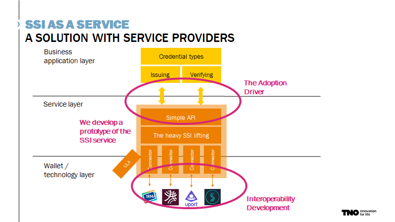

# SSI Service Provider — Working with credentials made easy
Do you want to issue or verify credentials, but lack either the time, manpower, interest, or experience to implement this yourself? Or do you simply want to avoid the hastle of implementing support for multiple different wallets, and dealing with (breaking) changes on their end? Then you may want to consider our SSI service!

> The SSI Service Provider strives to improve the usability of SSI in real life by providing basic functionality that assists in issuing and verifying credentials to and from multiple wallets.

Similar to a payment service provider allowing webshops to easilly support payment with MasterCard, Visa, PayPal, iDeal, bitcoin, and you name it, our objective is to faciliatate issuing and verifying to and from any of the popular SSI wallets. We currently support IRMA, Jolocom, and (almost done!) Hyperledger Indy, with more to come.

Sounds interesting? Or have any questions? Please let us know and we'll help you get up and running with our SSI service, or discuss your needs for credentials.

## Getting started
For information on how to integrate with our service, please contact [Peter Langenkamp](mailto:peter.langenkamp@tno.nl&cc=michiel.stornebrink@tno.nl), or refer to our documentation [here](./documentation.md).

## Try it out!
To quickly try out different aspects of the service, we encourage you to go to the utils page of our service. Here, you can register a new organization, define credential types, and manually create issue and verify requests for testing purposes. Detailed information on using these utilities can be found [here](./service-instructions/utils-overview.md). If you know what you are doing, you can go to the issue or verify page directly.

- [Utils](https://service.essif-lab-ssi.dev.grnet.gr/utils) [[?](./service-instructions/utils-overview.md)]
- [Issue](https://service.essif-lab-ssi.dev.grnet.gr/issue/someToken)
- [Verify](https://service.essif-lab-ssi.dev.grnet.gr/verify/someToken)