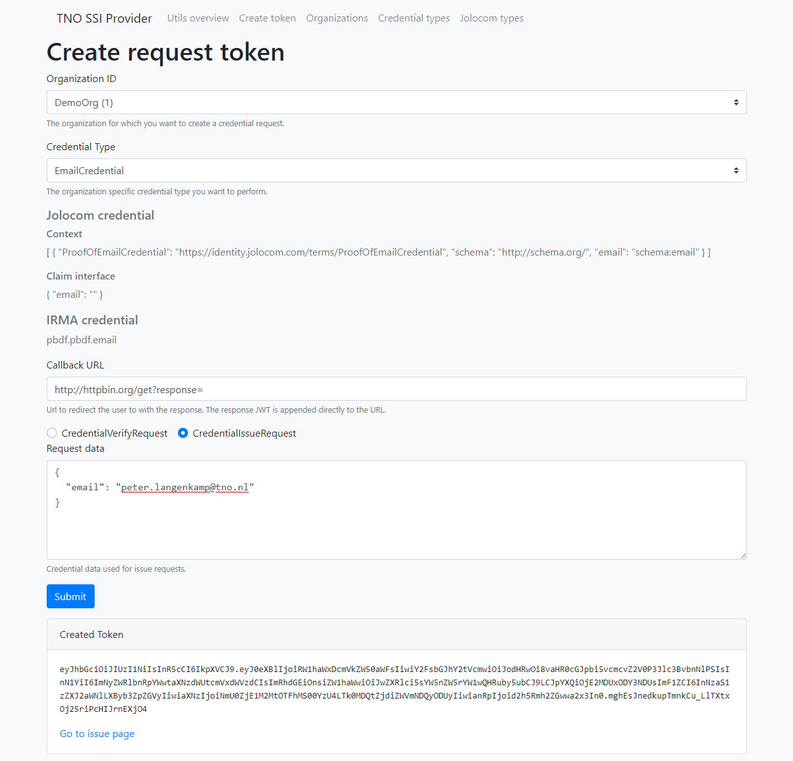
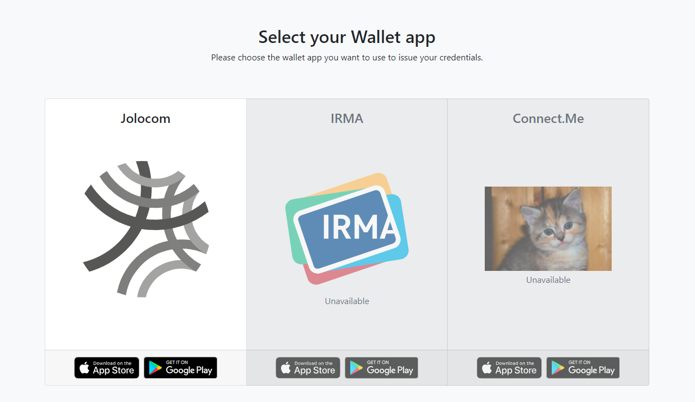

# Create token

Create tokens for testing the issuance and verifications of credentials.

## Create request token
1. Select the organization for which you want to issue / verify credentials.
2. Select the organization-specific credential type you want to issue / verify.
3. Enter the callback url to which the user will be redirected. The response JWT will be appended to this URL.
4. Select whether you want to create a credential issue or verify request
    * In case of an issue request, enter the credential data to be issued.
5. Submit.

## Example
For example, to create an issue request:

If you go to the issue page with this token, you can choose which wallet you want to use to store the credential:

## Debug token
Submit the request token for debug purposes.