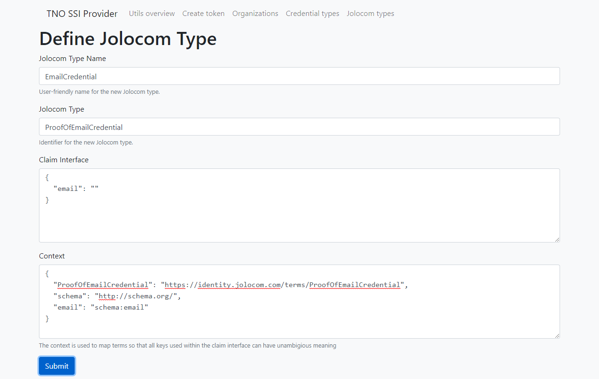

# Jolocom types

Define Jolocom credential types.

## Define Jolocom Type
1. Provide a user-friendly name for the new Jolocom credential type.
2. Name the identifier for the new Jolocom credential type.
3. Provide the claim interface for the new Jolocom credential type.
4. Provide the context for the new Jolocom credential type.
5. Submit.

## Example
For example, an email credential could be defined as follows:
