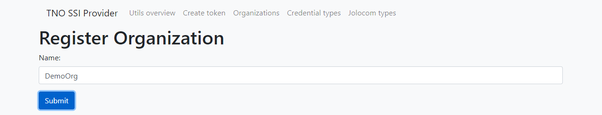

# Organizations

Register your organization. This allows you to issue and verify credentials using our SSI service.

## Register Organization
1. Enter the name of your organization
2. Submit. *(Registration may take a minute.)*
3. The registration response contains the uuid and sharedSecret.

## Example
For example, to define a mapping for an email credential:
